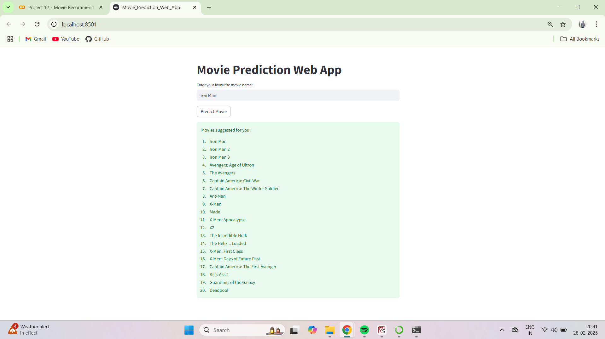

# Movie_Recommendation_System_Project

## Problem Overview
This project focuses on building a Movie Recommendation System using Machine Learning. The system suggests movies based on user preferences by leveraging cosine similarity and text-based feature extraction techniques. The process includes data collection, preprocessing, feature extraction, and model training to generate personalized recommendations.

## Project Title
Movie Recommendation System using Machine Learning

## Problem Overview
This project focuses on building a Movie Recommendation System using Machine Learning. The system suggests movies based on user preferences by leveraging cosine similarity and text-based feature extraction techniques. The process includes data collection, preprocessing, feature extraction, and model training to generate personalized recommendations.

## Features
1. Provides personalized movie recommendations
2. Uses TF-IDF vectorization for feature extraction
3. Implements cosine similarity for movie matching
4. Interactive web app built with Streamlit
5. Trained using ML models and deployed for real-time suggestions

## Dataset Used
Source: (Mention if it's from Kaggle or any other source)
Number of movies included
Columns used: title, genres, keywords, tagline, cast, director, etc.

## Screenshots of Web App

